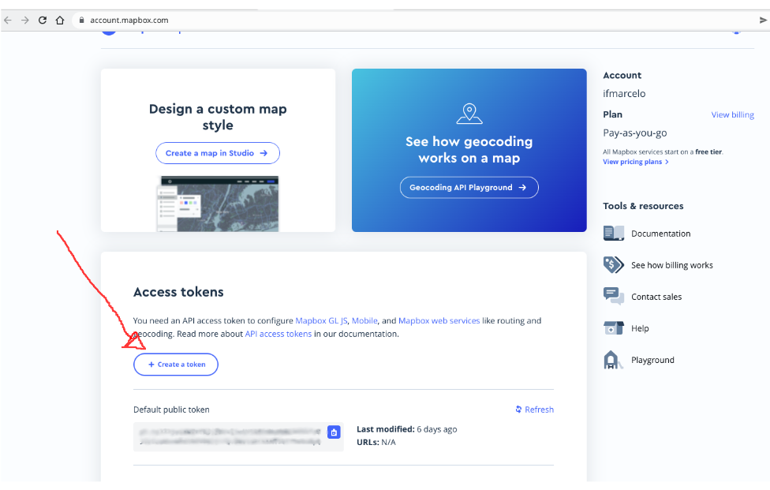

# Sobre o projeto
O objetivo do projeto é introduzir uma aplicação simples usando React com Leaflet e o MapBox. Essa aplicação foi baseada no seguinte tutorial: https://blog.rocketseat.com.br/mapas-com-react-usando-leaflet/.

Com essa aplicação será possível pesquisar um local, e marcar informação sobre a entrega de uma mercadoria.

# Execução do projeto
Para executar o projeto na sua máquina é necessário instalar o Node.js com npm no seguinte link: https://nodejs.org/pt-br/download/

Após o download será necessário executar os seguintes comandos para executar o projeto:
```
npm install --global yarn

yarn create react-app react-maps-leaflet --template typescript

cd react-maps-Leaflet

yarn add leaflet react-leaflet

yarn add react-select uuid

yarn add -D @types/react-leaflet @types/react-leaflet @types/react-select
```

Antes iniciar o projeto será ncessário criar uma conta gratuita no MapBox e gerar um TOKEN para executar a aplicação no seguinte link: https://account.mapbox.com/



Após isso, o TOKEN deve ser colocado no arquivo `.env` na variáveis de ambiente REACT_APP_ACCESS_TOKEN_MAP_BOX.

Em seguida o projeto pode ser iniciado por:
```
yarn run start
```

# Referências
- https://nodejs.org/pt-br/download/
- https://account.mapbox.com/
- https://blog.rocketseat.com.br/mapas-com-react-usando-leaflet/